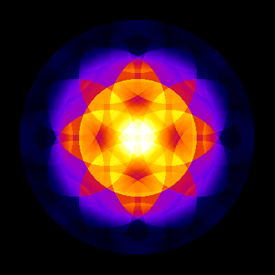

#  μSTEM 

μSTEM is a transmission electron microscopy (TEM) simulation suite, in particular for scanning transmission electron microscopy (STEM) images, that was developed mainly at the University of Melbourne. The computing suite is based on the multislice
method. More detail can be found in the [manual](muSTEM_manual.pdf) and the following scientific paper:

[Modelling the inelastic scattering of fast electrons,
L.J. Allen, A.J. D'Alfonso and S.D. Findlay,
Ultramicroscopy, Vol. 151, pp. 11-22, (2015).](http://www.sciencedirect.com/science/article/pii/S0304399114002034)

## Prerequisites

### GPU version

* 64 bit windows OS
* A CUDA enabled GPU with compute class 3.0 or greater
* Version 8.0 of the [Nvidia CUDA toolkit](https://developer.nvidia.com/cuda-toolkit-archive), this installs the .dll files necessary to run the GPU versions of μSTEM. Future versions of μSTEM will likely use later versions (9.0 and above) of the CUDA toolkit so this is a site you might have to revisit in future.

#### To compile source code

* [PGI Visual Fortran and Microsoft Visual Studio](https://www.pgroup.com/products/pvf.htm)

### CPU version

* 64 bit Windows OS

#### To compile source code

* Any Fortran 90 compiler and FFTW libraries

## Precompiled executables

* [**CPU** single precision](https://github.com/HamishGBrown/MuSTEM/raw/master/Executables/CPU_muSTEM_x64_v5.1_single_precision.zip)
* [**CPU** double precision](https://github.com/HamishGBrown/MuSTEM/raw/master/Executables/CPU_muSTEM_x64_v5.1_double_precision.zip)
* [**GPU** single precision](https://github.com/HamishGBrown/MuSTEM/raw/master/Executables/CUDA_muSTEM_x64_v5.1_single_precision.zip)
* [**GPU** single precision for legacy graphics cards](https://github.com/HamishGBrown/MuSTEM/raw/master/Executables/CUDA_muSTEM_x64_v5.1_single_precision_legacy.zip)
* [**GPU** double precision](https://github.com/HamishGBrown/MuSTEM/raw/master/Executables/CUDA_muSTEM_x64_v5.1_double_precision.zip)

### Compiling source code

MuSTEM is built using the [PGI Fortran compiler and Microsoft Visual Studio 2015](https://www.pgroup.com/products/pvf.htm), please make sure that this software is correctly installed before proceeding. Create a new Visual Studio project and add the source code contained in this repository. The GPU version of the code requires the source files in the GPU_routines folder and the CPU only version of the code requires the source files in the CPU_routines folder. Modify the project properties so that Microsoft Visual Studio passes the following commands to the PGI compiler:

Build commands:

-Mpreprocess -Bstatic -Mbackslash -mp -Mcuda=cuda8.0 -I"C:\Program Files\PGI\win64\17.3\include" -I"c:\program files\pgi\win64\17.3\include" -I"C:\Program Files\PGI\Microsoft Open Tools 14\include" -I"C:\Program Files (x86)\Windows Kits\10\Include\shared" -I"C:\Program Files (x86)\Windows Kits\10\Include\um" -fast -ta=tesla -Minform=warn 

To build the single precision version add the command -Dsingle_precision. For the Double precision version add the command -Ddouble_precision. To build the GPU version (requires the PGI compiler) add the command -Dgpu. The code also requires recursive routines to be enabled (The  /recursive command in the Intel Visual Fortran compiler) for correct calculation of the absorptive form factors.

Linker commands:

-Bstatic -mp -Mcuda=cuda8.0 -ta=tesla -o"$(Outdir)\MuSTEM_Open.exe" -Wl,/libpath:"C:\Program Files\PGI\win64\17.3\lib" -Wl,/libpath:"C:\Program Files\PGI\win64\2017\cuda\8.0\lib64" cufft.lib 

The links to the PGI CUDA libraries and Windows kits may need to be modified depending on the install directories. $(Outdir) represents the output directory of the Microsoft Visual Studio build.

Some example simulations are included on the [MuSTEM website](http://tcmp.ph.unimelb.edu.au/mustem/download.php).

## Contributing

Please contact [Dr. Hamish Brown](https://github.com/HamishGBrown) with project suggestions and contributions.

## Authors
* **Professor Les J Allen**
* [**Dr. Hamish G Brown**](https://github.com/HamishGBrown) - *Maintainer*
* **Dr. Adrian J D'Alfonso**
* **Dr. Scott D Findlay**
* **Dr. Ben D Forbes**

## License

This project is licensed under the GNU GPLv3.0 - see the [LICENSE.txt](LICENSE.txt) file for details.

## Acknowledgments

Les Allen, Adrian D'Alfonso and Scott Findlay originally took the initiative to make this code publicly available, with Adrian D'Alfonso taking on the considerable task of setting up the GPU code. Hamish Brown and Ben Forbes have subsequently made substantial refinements and extensions, with Ben Forbes responsible for several efficiency improvements. The code was developed mainly at the University of Melbourne. We would like to acknowledge the contributions of Mark Oxley and Chris Rossouw to the theoretical and numerical aspects of collaborative research that underpins μSTEM 4.9.

In particular, the code IONIZER, whose primary author has been Mark Oxley, was used to set up the parametrized atomic scattering factors for ionization used in μSTEM 4.9. Eireann Cosgriff, Torgny Josefsson, Nathan Lugg, Andrew Martin, Gary Ruben and Chris Witte have been or still are members of the group at Melbourne University at various stages and all made contributions to our understanding of inelastic scattering and the simulation thereof. 

